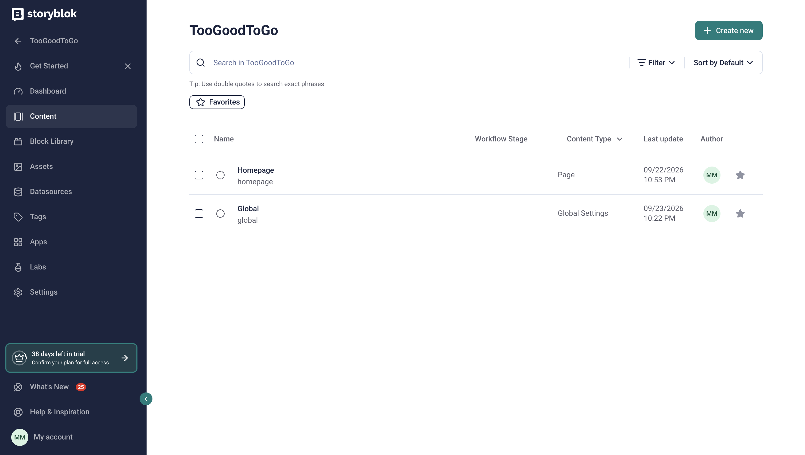

# Edit the Header and Footer in Storyblok

This guide is for content editors. You don’t need to write any code. You only need access to the project in Storyblok.

You’ll see a few Storyblok words in this guide:

- A **story** is a piece of content in Storyblok, such as a page.
- A **block** is one part of a story, such as a menu item or a footer column.
- A **field** is a box you fill in on a block, such as a label or a link.

The header and footer are saved in one story called **Global**. When you change it, the change shows on every page of the website.

## Open the Global story

To start editing, open the Global story:

1. In Storyblok, select **Content** in the left menu.
2. Select the **Global** story.

Storyblok opens the story in the **Visual Editor**. On the left is a preview of the header and footer. On the right is the form where you make changes. Select any part of the preview, such as a menu item, and the form jumps to it.

The form has three tabs:

- **General:** the website name shown in the browser tab
- **Navigation:** the header menu
- **Footer:** the footer

## Change the header menu

The header menu has three levels. Each level has its own block name in Storyblok:

| Level | What it is | Example | Block name |
|---|---|---|---|
| Main menu item | A word in the header bar | **About** | **Navigation Button** |
| Column | A group of links in the dropdown menu, with a heading | **The app** | **Navigation Panel Column** |
| Link | One link in a column | **Our history** | **Navigation Panel Item** |

### Add a main menu item

Each main menu item is a block in the **Navigation** tab:

1. On the **Navigation** tab, open the **Navigation** block.
2. Under **Buttons**, add a block. Storyblok offers one choice here: **Navigation Button**.
3. In **Label**, type the text to show in the header.
4. Optional: in **Link**, choose the page this item opens.

A main menu item without columns is a plain link. Once you add a column, the item opens a dropdown menu instead. If the item also has a link, the link shows at the bottom of the dropdown as “Explore” plus the item’s name, such as **Explore About**.

### Add columns and links

Columns and links go inside a main menu item:

1. Open the main menu item.
2. Under **Panel**, add a block. This is a column. In **Heading**, type the column’s title.
3. Open the column. Under **Items**, add one block for each link.
4. For each link, fill in **Label** (the text) and **Link** (where it goes).

To change the order of menu items, columns, or links, move their blocks up or down in the form. The header shows them in the same order.

## Set a link

Every **Link** field can point to one of two places. To choose, select the globe icon at the start of the field:

- **A page on this website:** choose the page from the list. If someone renames or moves that page later, the link still works.
- **Another website:** type the web address, such as `https://example.com`. If you leave out `https://`, the website adds it for you.

## Edit the footer

The **Footer** tab has three sections:

- **Footer:** the columns of links. Each **Footer Column** block has a **Heading**, such as **Legal**. Under **Items**, add one **Footer Link** block for each link, with a **Label** and a **Link**.
- **Newsletter:** the newsletter sign-up. Fill in the **Heading**, the **Text**, the **Button Label** (the words on the button), and the **Button Link** (where the button goes). A new newsletter block starts with the current text already filled in. The footer has room for one newsletter.
- **Social Links:** the social media icons. Add one **Social Link** block for each icon. Choose the **Platform**, such as Instagram, and add the profile address in **Link**. The list offers Instagram, Facebook, TikTok, X, and YouTube.

## Publish your changes

The preview shows your changes as you work, but visitors don’t see them yet:

- Select **Save** to keep your work as a draft.
- Select **Publish** to show your changes on the live website.

Visitors see the new header and footer the next time they open or reload a page.

## Rules that keep the header and footer working

Storyblok only offers choices that the website can show:

- Each section accepts one type of block, so every block ends up in the right place. For example, a footer link can’t go into the header menu.
- The menu stops at three levels. Visitors of the old website rarely went deeper, so links in a column can’t hold more links.
- Fields with a red star (*) are required. Links need a **Label** and a **Link**, and social media icons need a **Platform** and a **Link**, so nothing appears empty or broken. A main menu item only needs a **Label**.
- LinkedIn isn’t in the social media list, because the icon set the website uses has no LinkedIn logo.

Developers can read how these rules are set up in [Guardrails for editors](../developers/content-model.md#guardrails-for-editors).
